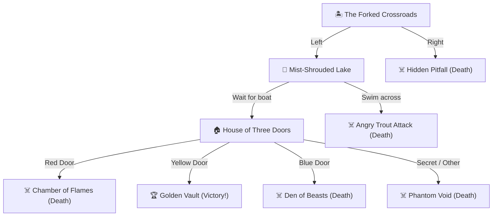

# 🏝️ Treasure Island — The Lost Treasure

A cinematic, interactive browser-based pirate adventure game upgraded from a Python text adventure into a modern web experience built with **React**, **Vite**, **Web Audio API**, and **SVG graphics**.

🎮 **[Play Live on GitHub Pages](https://shimsy20240996-lang.github.io/Treasure-island-game/)**

---

## 🏴‍☠️ Project Overview & Transformation

This project began as a beginner-friendly Python terminal adventure (`task.py`) utilizing nested conditionals. It has been transformed into an indie-game caliber web application with:

1. **Original Logic Preservation**: 100% faithful adherence to the branching paths, story choices, death outcomes, and victory conditions from the original Python source of truth.
2. **Cinematic Visual Aesthetic**: Custom typography (`Cinzel`, `Pirata One`, `Outfit`), dark ocean & gold palette, glassmorphism cards, and dynamic canvas particle atmospheric effects.
3. **Interactive Pirate Map**: Hand-crafted SVG parchment expedition chart with animated trail routes, location discovery markers, and compass rose.
4. **Procedural Web Audio API Engine**: Built-in sound synthesizer generating ambient ocean waves, wind drones, UI clicks, choice chimes, lake splashes, fire crackling, beast roars, and triumphant gold victory fanfares with **zero external dependencies** and 100% offline support.
5. **Expedition Systems**: Player health ❤️, gold coin plunder 💰, depth progress tracker 🧭, inventory relic inspection 🗝️, keyboard shortcuts, and auto-saving via `localStorage`.

---

## 🗺️ Decision Tree & Story Nodes

All story paths from `task.py` are fully preserved:



---

## 🛠️ Technology Stack

- **Framework**: [React 18](https://react.dev/)
- **Build Tool**: [Vite 6](https://vitejs.dev/)
- **Styling**: Vanilla Modern CSS (Tailored HSL & Dark Ocean Tokens, Glassmorphism, CSS Animations)
- **Icons**: [Lucide React](https://lucide.dev/)
- **Sound**: Native Web Audio API Procedural Synthesizer
- **Visuals**: SVG Vector Pirate Map & HTML5 Canvas Ambient Particles
- **Celebration**: Canvas Confetti
- **Legacy Foundation**: Python 3 (`task.py`)

---

## 🎮 Game Features & Controls

| Feature | Description |
| :--- | :--- |
| **Keyboard Navigation** | Press `[1]`, `[2]`, `[3]`, `[4]` to instantly trigger story choices. `Enter` to retry, `Esc` for Main Menu. |
| **Typewriter Narrative** | Atmospheric text reveal with sound effects and instant-skip button. |
| **Expedition Chart** | Visualizes discovered, cleared, and locked locations in real time. |
| **Relics & Journal** | Inspect collected artifacts (Compass, Oar Fragment, Skeleton Key, Captain's Crown) to discover lore. |
| **Audio Controls** | Sliders for Master, Ocean Ambience, and Sound Effects with instant mute toggles. |
| **Accessibility** | High Contrast Mode, Reduced Motion toggle, and full ARIA support. |
| **State Persistence** | Automatically saves your location, health, coins, and discovered relics in `localStorage`. |

---

## 🚀 Getting Started Locally

### Prerequisites
- Node.js (v18 or higher recommended)
- npm or yarn

### Installation

```bash
# Clone the repository
git clone https://github.com/shimsy20240996-lang/Treasure-island-game.git

# Navigate into the project
cd "Treasure Island Game"

# Install dependencies
npm install

# Start the Vite development server
npm run dev
```

Open [http://localhost:3000](http://localhost:3000) in your browser to begin your expedition!

### Production Build

```bash
# Compile and optimize for production
npm run build

# Preview production build locally
npm run preview
```

### Running Original Python Version

```bash
python task.py
```

---

## 📜 Credits & License

- **Original Concept**: Classic Python Treasure Island text adventure.
- **Web Transformation**: Developed with React, Vite, Web Audio API, and custom motion design.
- **License**: MIT
