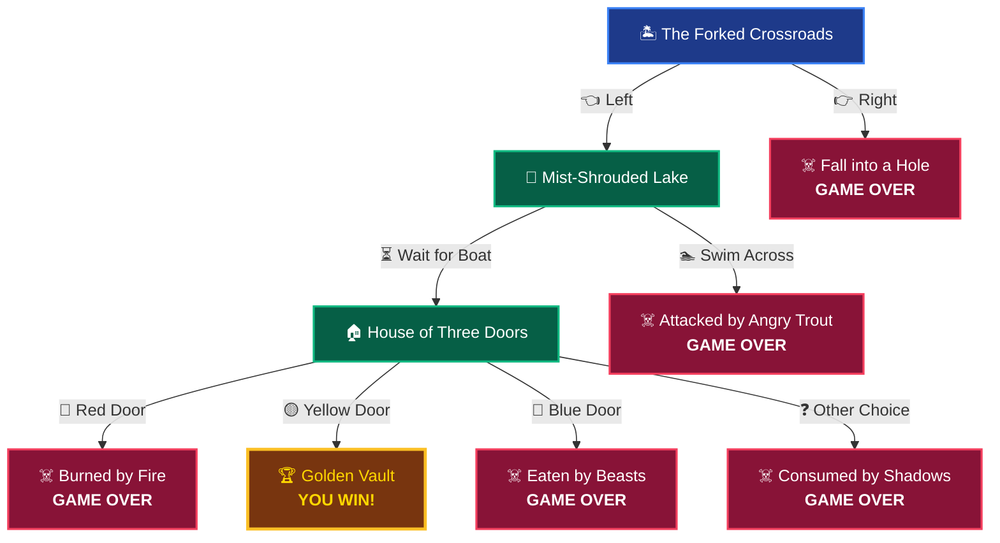

# 🏝️ Treasure Island — The Lost Treasure

<div align="center">

```text
       _~
    _~ )_)_~
    )_))_))_)
    _!__!__!_         ⚔️  THE LOST TREASURE OF SKELETON REEF  ⚔️
    \______t/     ~~~~~~~~~~~~~~~~~~~~~~~~~~~~~~~~~~~~~~~~~~~~~~~~~
  ~~~~~~~~~~~~~   "Only the bold shall claim the pirate king's gold!"
```

[](https://shimsy20240996-lang.github.io/Treasure-island-game/)
[](https://react.dev/)
[](https://vitejs.dev/)
[](https://developer.mozilla.org/en-US/docs/Web/API/Web_Audio_API)
[](https://opensource.org/licenses/MIT)

**A cinematic, interactive pirate web adventure built with React, Vite, SVG graphics, and a procedural Web Audio synthesizer.**

[🕹️ Play Game](https://shimsy20240996-lang.github.io/Treasure-island-game/) • [🗺️ Story Flow](#-interactive-story-decision-tree) • [✨ Key Features](#-key-features) • [🚀 Local Setup](#-getting-started-locally) • [🏗️ Architecture](#-project-architecture)

</div>

---

## 📖 The Story

> *"Welcome to Treasure Island. Your mission is to find the legendary lost treasure hidden deep within the treacherous uncharted island. Beware—one wrong step could plunge you into a bottomless pit, seal you in a chamber of flames, or deliver you into the jaws of wild beasts..."*

Originally conceived as a classic Python terminal conditional exercise (`task.py`), this project has been fully reimagined as an immersive indie-grade web adventure. It combines the suspense of classic interactive fiction with modern cinematic visuals, dynamic soundscapes, and interactive cartography.

---

## ✨ Key Features

| Feature | Description |
| :--- | :--- |
| 📜 **Faithful Story Branching** | Preserves 100% of the original logic, perils, choices, and victory paths from the classic adventure. |
| 🗺️ **Interactive Expedition Map** | Hand-crafted SVG parchment chart showing discovered routes, cleared milestones, and unexplored regions. |
| 🎵 **Procedural Web Audio Engine** | Synthesizes ambient ocean tides, wind drones, UI clicks, trap triggers, and celebratory fanfares with **zero external audio files**. |
| 🎒 **Inventory & Relic Lore** | Collect and inspect pirate artifacts including the *Ancient Compass*, *Oar Fragment*, *Skeleton Key*, and the legendary *Captain's Crown*. |
| ⌨️ **Full Keyboard & Touch Support** | Play effortlessly with numbers `[1]`, `[2]`, `[3]`, `[4]`, `[Enter]` to retry, `[Esc]` for settings, or standard touch gestures. |
| ✨ **Particle Atmosphere** | Dynamic HTML5 canvas floating embers, sea mist, and victory confetti effects. |
| 💾 **Auto-Save & Persistence** | Saves your health, coin balance, discovered locations, and inventory in `localStorage`. |
| ♿ **Accessibility & Themes** | Includes high-contrast mode, reduced motion toggle, and volume customization. |

---

## 🗺️ Interactive Story Decision Tree

Every choice leads to a distinct outcome. Explore every path to find the one true path to the golden vault:



---

## 🎧 Procedural Web Audio Engine

The game features an entirely self-contained audio synthesizer powered by the **Web Audio API**:

- **🌊 Ambient Ocean Generator**: Multi-layered pink/brown noise buffers shaped with lowpass sweep filters and dual LFO modulation to create continuous ocean shore swells.
- **🌬️ Coastal Wind Drone**: Sine & triangle wave oscillators creating atmospheric ambient breeze.
- **🔔 Action Sound Effects**:
  - `playClick()`: Crisp high-frequency transient UI click.
  - `playChoice()`: Resonant dual-tone melodic affirmative chime.
  - `playSplash()`: Frequency-modulated splash for water encounters.
  - `playFire()`: White noise burst with randomized decay for flame bursts.
  - `playRoar()`: Low-sawtooth rumble for beast encounters.
  - `playFanfare()`: Multi-oscillator 5-note brass arpeggio for victory celebrations!

---

## 🎮 Controls & Shortcuts

| Key | Action |
| :---: | :--- |
| `1` / `2` / `3` / `4` | Select corresponding story choice |
| `Space` | Skip typewriter animation / advance story |
| `Enter` | Restart expedition after game over / win |
| `Esc` | Open Game Settings modal |
| `M` | Quick toggle Audio Mute |

---

## 🛠️ Tech Stack & Architecture

- **Frontend**: [React 18](https://react.dev/) + JSX
- **Build System**: [Vite 6](https://vitejs.dev/)
- **Styling**: Vanilla Modern CSS (Tailored HSL Design Tokens, Dark Ocean Palette, Glassmorphism, CSS Transitions)
- **Icons**: [Lucide React](https://lucide.dev/)
- **Audio**: Web Audio API (Native browser audio synthesis, 0 audio assets required)
- **Visuals**: SVG Vector Cartography + HTML5 Canvas Ambient Particle Engine
- **CI/CD**: GitHub Actions (`.github/workflows/deploy.yml`) with automated deployment to GitHub Pages

---

## 📂 Project Architecture

```
Treasure Island Game/
├── .github/
│   └── workflows/
│       └── deploy.yml        # Automated GitHub Pages CI/CD workflow
├── src/
│   ├── components/           # Modular UI Components
│   │   ├── CanvasParticles.jsx  # Atmospheric floating ember/mist canvas
│   │   ├── ChoiceButton.jsx     # Animated interactive choice controls
│   │   ├── CinematicIntro.jsx   # Prologue title splash sequence
│   │   ├── GameHUD.jsx          # Health, gold coins, depth tracker, menu triggers
│   │   ├── GameOver.jsx         # Defeat screen with death summary & stats
│   │   ├── GameScreen.jsx       # Core adventure container
│   │   ├── HowToPlayModal.jsx   # Rules, guide, and shortcuts dialog
│   │   ├── Inventory.jsx        # Relic collection & lore drawer
│   │   ├── MainMenu.jsx         # Atmospheric title menu
│   │   ├── ProgressBar.jsx      # Expedition depth indicator
│   │   ├── SettingsModal.jsx    # Audio volume & accessibility controls
│   │   ├── StoryPanel.jsx       # Typewriter story narrative renderer
│   │   ├── TreasureMap.jsx      # Interactive SVG parchment island chart
│   │   └── VictoryScreen.jsx    # Celebration screen with confetti & loot summary
│   ├── data/                 # Game Data & Narrative Script
│   │   ├── achievements.js   # Discoverable milestone achievements
│   │   ├── items.js          # Relics & inventory item definitions
│   │   ├── locations.js      # Map coordinates & zone descriptors
│   │   └── story.js          # Branching story node tree & outcomes
│   ├── hooks/
│   │   └── useGameState.js   # Central game state management & local persistence
│   ├── utils/
│   │   ├── audio.js          # Procedural Web Audio API sound synthesizer
│   │   └── gameLogic.js      # Outcome calculation & helper methods
│   ├── App.jsx               # Root application coordinator
│   ├── index.css             # Theme tokens, custom typography & utilities
│   └── main.jsx              # React entry point
├── task.py                   # Original Python terminal game source
├── package.json              # Dependencies & npm scripts
└── vite.config.js            # Vite build & asset configuration
```

---

## 🚀 Getting Started Locally

### Prerequisites
- [Node.js](https://nodejs.org/) (version 18.0 or higher recommended)
- `npm` (included with Node.js)

### Installation & Run

```bash
# 1. Clone the repository
git clone https://github.com/shimsy20240996-lang/Treasure-island-game.git

# 2. Enter project folder
cd "Treasure Island Game"

# 3. Install dependencies
npm install

# 4. Start local development server
npm run dev
```

Open [http://localhost:3000](http://localhost:3000) in your browser to play!

### Production Build

```bash
# Build optimized production bundle to dist/
npm run build

# Preview production build locally
npm run preview
```

### Running Original Python Version

```bash
python task.py
```

---

## 🌐 Deployment to GitHub Pages

This repository is configured with an automated **GitHub Actions** deployment pipeline.

Every push to the `main` branch automatically triggers `.github/workflows/deploy.yml`, which:
1. Checks out the code and installs dependencies (`npm ci`).
2. Runs the production build (`npm run build`).
3. Deploys the optimized bundle to GitHub Pages.

---

## 📜 License

This project is open-source and available under the [MIT License](LICENSE).

---

<div align="center">

Made with ⚓ and ☕ for pirate adventurers everywhere.

**[⚔️ Embark on the Quest](https://shimsy20240996-lang.github.io/Treasure-island-game/)**

</div>
